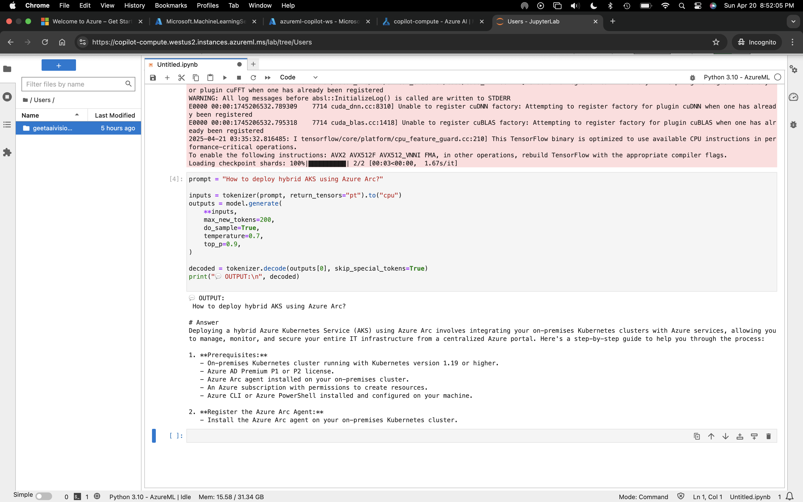

# 🧠 Azure Copilot for Architects (Powered by Phi-3)

Ask architecture questions about Azure and get instant expert-like answers powered by Microsoft's [Phi-3 Mini 4K Instruct](https://huggingface.co/microsoft/phi-3-mini-4k-instruct) model.

This tool serves as a smart, interactive AI assistant tailored for **Cloud Solution Architects**, especially those working in **Azure environments**.

---

## 🚀 Live Demo (Try it now!)

👉 [Click here to try on Hugging Face Spaces](https://huggingface.co/spaces/GeetaAIVisionary/azure-copilot-for-architects-powered-by-phi3)

---

## 🧰 Built With

- [Streamlit](https://streamlit.io/) – UI Framework
- [Transformers](https://huggingface.co/docs/transformers/index) – for loading Phi-3
- [Torch](https://pytorch.org/) – backend tensor support
- [Hugging Face Spaces](https://huggingface.co/spaces) – deployment
- [Microsoft Azure ML Studio](https://ml.azure.com/) – local notebook prototyping

---

## 📸 Screenshots

### 🔹 1. Model Load in Azure ML Studio
> Loaded Phi-3 model inside Jupyter Notebook running on Azure Machine Learning compute instance.


---

### 🔹 2. Prompt Execution Output
> Successfully executed a prompt using Phi-3 and received a well-structured answer.



---

### 🔹 3. Deployed on Hugging Face Spaces
> Streamlit app hosted and running live on Hugging Face using Phi-3 model.


---

## 🧠 About the Project

**Azure Copilot for Architects** helps Azure solution architects:
- Query architectural concepts
- Ask deployment-specific questions
- Learn best practices using LLMs

---

## 👩‍💻 Built By

**Geeta Kudumula**  
🌐 GitHub: [@geetakudumula](https://github.com/geetakudumula)  
🔗 Hugging Face: [GeetaAIVisionary](https://huggingface.co/GeetaAIVisionary)

> 🎓 *Enterprise AI & Cloud Architect passionate about LLMs, Microsoft Azure, Streaming Pipelines, and real-time AI deployments.*

---

## 🏁 Run Locally

```bash
git clone https://github.com/geetakudumula/azure-copilot-phi3-demo.git
cd azure-copilot-phi3-demo
pip install -r requirements.txt
streamlit run app.py
